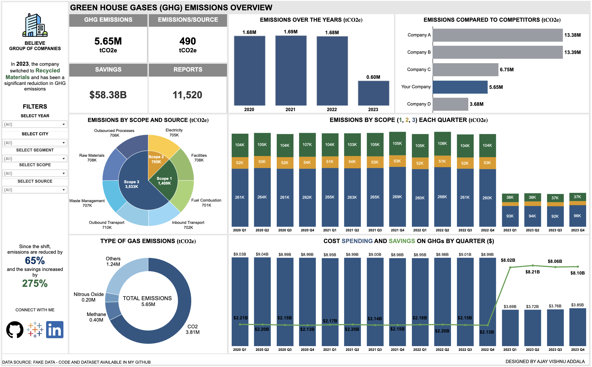

# Climate Tech Company Dashboard

This is a dashboard project created for a Climate Tech company that helps other product-based companies analyze and manage their greenhouse gas (GHG) emissions, cost savings, and sustainability efforts.

## Dataset

Since no publicly available dataset was found, I created a fake dataset using Python. The dataset includes the following information:

- Company emissions (in tons of CO2 equivalent)
- Emissions by source (e.g., energy, transportation, waste)
- Emissions by GHG gas type (e.g., CO2, CH4, N2O)
- Cost spending and savings (in USD)
- Quarterly data from 2020 to 2023

## Dashboard Features

The dashboard aims to address the following key questions:

1. **KPIs**: Emissions, Emissions/Source, Overall Reports, and Cost Savings
2. Company emissions compared to competitors
3. Emissions by each source
4. Split of different GHG gases by volume emissions
5. Emissions by category over each quarter
6. Cost spending and savings over each quarter

The dashboard showcases the company's transition to recycled materials in 2023, which resulted in a dip in emissions and an increase in cost savings.

## Dashboard Snapshot

Here's a snapshot of the dashboard:

## Usage

To use this dashboard, you can clone the repository and run the necessary Python scripts to generate the dataset and create the dashboard visualization. The code is available in the project's GitHub repository.
